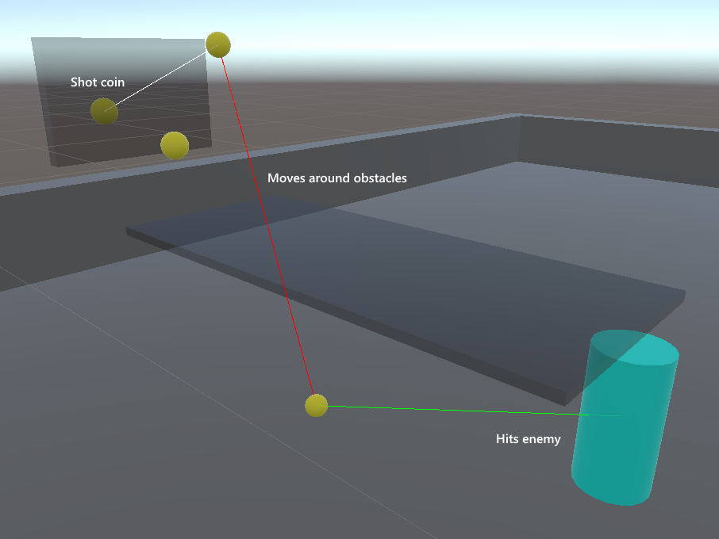

# CoinShotProject
The coinshot mechanic from Ultrakill recreated with extra logic sprinkled on top 

  

In Ultrakill, the player can throw up to 4 coins. When the player shoots this coin out of the air, the bullet will ricochet to the nearest enemy. If more than one coin has been thrown, the bullet will ricochet from coin to coin, until finally going to the nearest enemy after all the coins have been hit. If there are no enemies nearby, the coin will not hit anything and shoot into a random direction. If the path to all nearby enemies is blocked, this will happen as well.

  
  

I've done my best to recreate this in Unity. You can place little balls that simulate the coins in the scene window. Where my version differs, though, is that when the final coin in the sequence can't reach any targets, it will roll back to the previous coin and check if there are any targets that are reachable. 

